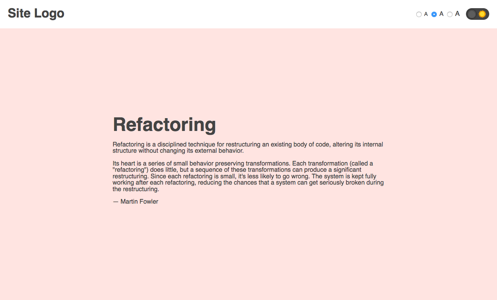
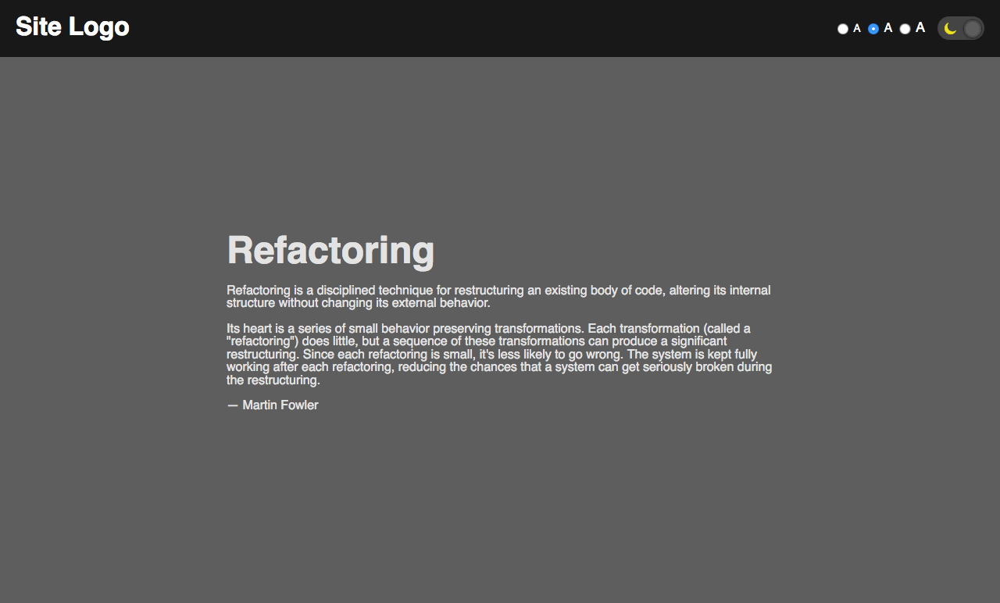

# Local storage

Let's create a simple page with some content (you can reuse the same text that is in the screenshots, it is at the bottom, but you dont have to!) that will respond to user's preferences. Specifically, we will allow the user to change the theme between light and dark, and change the font size between small, medium and large.

1. Let's add a UI element that will allow the user to toggle the theme between light and dark. Since we will be changing between two states, we could use a checkbox and style it to look like a toggle (we have done this before). By default, the light theme is selected.

Toggle with light theme selected:




Toggle with dark theme selected:




Every time the user selects a new theme, we need to save it in the local storage.
So next time the user refreshes the page, the theme stored in the local storage will be applied and the toggle will have the right theme selected.

2. Next, let's add some font size controls. The user can switch between small, medium and large font size. Since the user can select one option at a time, we could use radio buttons.


By default, the medium size is applied. Whenever the user changes the size, the newly selected size should be saved into local storage so their preference is preserved and applied the next time they visit the site.

> Text if you want to use the same:

```
Refactoring

Refactoring is a disciplined technique for restructuring an existing body of code, altering its internal
structure without changing its external behavior.

Its heart is a series of small behavior preserving transformations. Each transformation (called a "refactoring")
does little, but a sequence of these transformations can produce a significant restructuring. Since each
refactoring is small, it's less likely to go wrong. The system is kept fully working after each refactoring,
reducing the chances that a system can get seriously broken during the restructuring.

Martin Fowler
```

(taken from https://refactoring.com/)